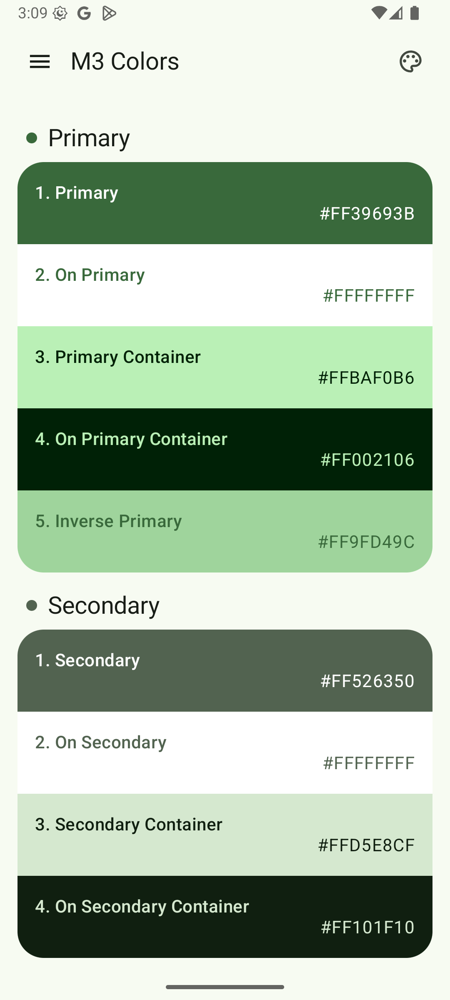
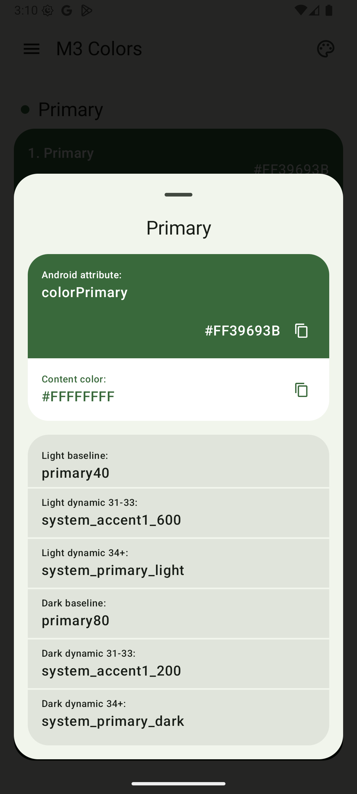
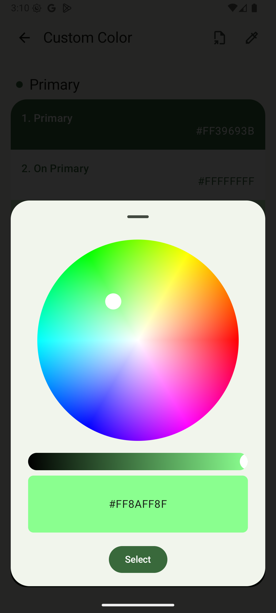

## Material Color Scheme

The Material 3 color theming system can be used to create a color scheme that reflects your brand or
style.

The Material 3 color theming system uses an organized approach to apply colors to your UI. Material
components use theme colors and their variations to style backgrounds, text, and more.

## Features

- Android Attribute Name
- Color Hex
- Baseline Name
- Dynamic Name
- Copy Color
- Export (.json)
- Custom Base Color

## Screenshot

<table>
  <tr>
    <td>System Colors</td>
    <td>Detail Color</td>
    <td>Custom Color</td>
  </tr>
  <tr>
    <td></td>
    <td></td>
    <td></td>
  </tr>
 </table>

## Sample

